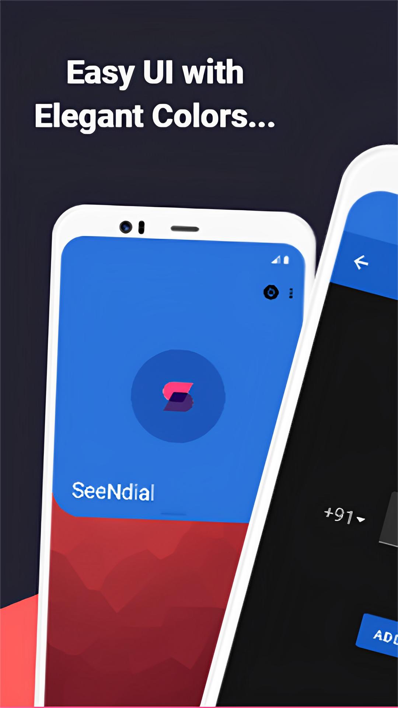
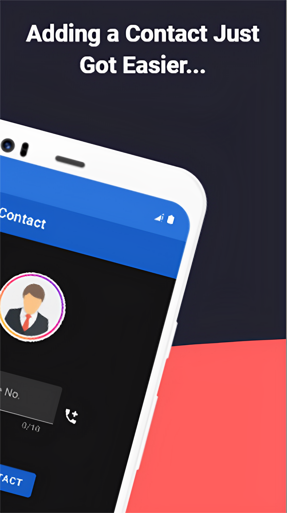
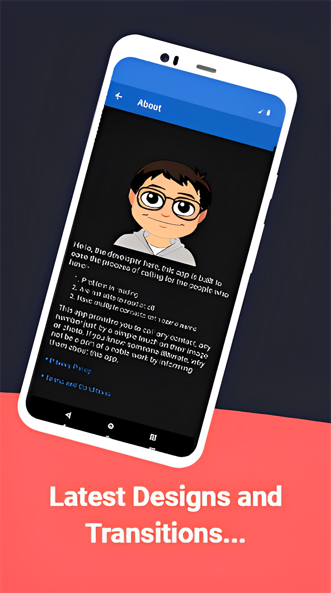
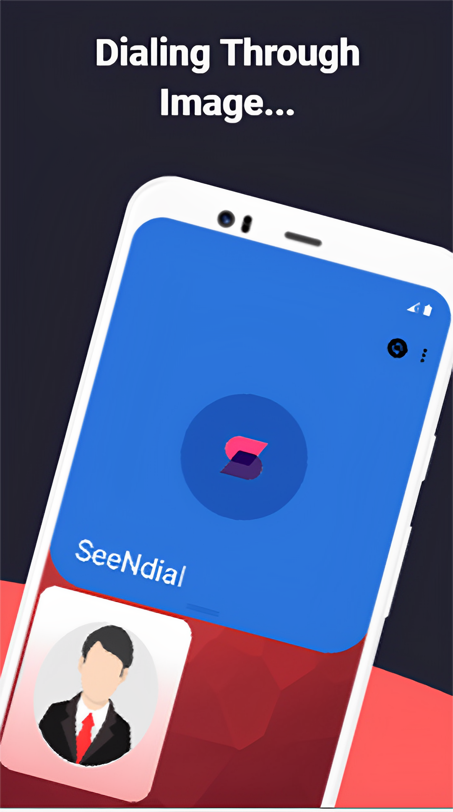

# SeeNdial - Imagify Contacts 📞
<a href="https://play.google.com/store/apps/details?id=info.fortheease.seendial">
    
</a>


-lightgrey)

> **Note:** This project was originally built when I was in **9th Grade**. It was created with the mission to help those who struggle with literacy or technical complexity.

**SeeNdial** is a simplified dialer application designed to make phone calls accessible through visual recognition. Instead of scrolling through text-based contact lists, users can initiate calls by simply tapping on a person's photo.

---

## 📖 The "Why" Behind SeeNdial

Tired of making five clicks just to initiate a phone call? SeeNdial eases the process by allowing users to save contacts as images.

### Who is this for?
1.  **Illiterate or Low-Literacy Users:** People who find it difficult to read names in a standard contact list.
2.  **Visual Learners:** Those who identify people faster by face than by name.
3.  **Organizing Duplicates:** Solving the confusion of having multiple contacts with the same name.

---

## 📸 Screenshots

      
---

## ✨ Key Features

* **Visual Speed Dial:** A grid-based UI showing contact photos for instant calling.
* **Easy Setup:** Simple workflow to link a phone number to an image from the gallery.
* **Customizable UI:**
    * Change contact shapes (Round, Oval, Square).
    * Adjust border colors and corner radii.
    * Toggle between elegant light/dark themed backgrounds.
* **Global Reach:** Built-in support for international country codes.
* **Interactive Onboarding:** Guided tutorials using **TapTargetView** to help first-time users navigate the app.

---

## 🛠 Tech Stack

* **Language:** Java
* **Database:** Room Persistence Library (SQLite)
* **Architecture:** MVVM (Model-View-ViewModel) pattern concepts

### UI/UX & Animations
* **MotionLayout:** For smooth transitions and complex animations.
* **Lottie:** High-quality vector animations for a modern feel.
* **ViewBinding:** For safe and efficient interaction with layout files.

### Key Libraries
* **[Dexter](https://github.com/Karumi/Dexter):** For seamless runtime permission handling.
* **[StyleableToast](https://github.com/Muddz/StyleableToast):** For custom, aesthetically pleasing toast notifications.
* **[CircleImageView](https://github.com/hdodenhof/CircleImageView):** For circular contact profile pictures.
* **[TapTargetView](https://github.com/KeepSafe/TapTargetView):** For interactive feature discovery prompts.
* **Gson:** For data serialization.

---

## 🚀 How to Run

1.  **Clone the repository:**
    ```bash
    git clone [https://github.com/YOUR_USERNAME/SeeNdial.git](https://github.com/YOUR_USERNAME/SeeNdial.git)
    ```

2.  **Open in Android Studio:**
    Open the project directory in Android Studio.

3.  **Configure AdMob (Optional):**
    Create a `local.properties` file in the root directory and add your AdMob IDs (or use dummy IDs for testing).
    *Note: Never commit your real API keys to GitHub.*
    ```properties
    ADMOB_APP_ID=ca-app-pub-xxxxxxxxxxxxxxxx~xxxxxxxxxx
    ADMOB_BANNER_ID=ca-app-pub-xxxxxxxxxxxxxxxx/xxxxxxxxxx
    ADMOB_REWARDED_ID=ca-app-pub-xxxxxxxxxxxxxxxx/xxxxxxxxxx
    ```

4.  **Build and Run:**
    Sync Gradle and run the app on an emulator or physical device (Min SDK: API 23+).

---

## 📄 License

This project is licensed under the MIT License - see the [LICENSE](LICENSE) file for details.

---

## 💡 Support the Project

If you find this project helpful or inspiring (considering it was a 9th-grade creation!), feel free to:

* ⭐ Star this repository.
* fork Fork it and suggest improvements.
* 📢 Share it with someone who might benefit from a visual dialer.

**Developed with ❤️ by Nishkarsh (ForTheEase)**